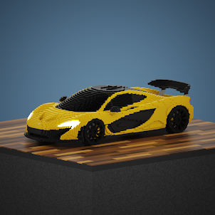

项目网站、社交联系方式、项目介绍内容详见：https://opensea.io/collection/carbits

每一位 CarBits 车主都将在我们的完整收藏结束时收到他们汽车的 3D 模型。车主将收到所有必要的文件，让他们的汽车在虚拟世界、AR 应用程序中使用并进行 3D 打印。

##### ▶ 什么是 CarBits？

CarBits 是一个 NFT（不可替代代币）集合。存储在区块链上的数字艺术品集合。

##### ▶ 有多少 CarBits 代币？

总共有 64 个 CarBits NFT。目前，34 位车主的钱包中至少有一个 CarBits NTF。

##### ▶ 最近售出了多少 CarBit？

过去 30 天内售出了 0 个 CarBits NFT。

.png)

**截止至8月30日**

64**项目**

34**拥有者**

6.0**总容积**

0.07**底价**