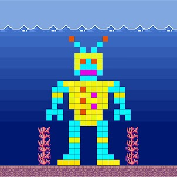
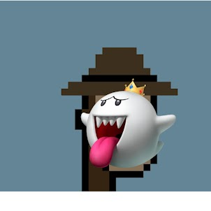

项目网站、社交联系方式、项目介绍内容详见：https://opensea.io/collection/cardshop-metaspac-growth-series

Cardshop 将致力于数字特许经营的货币化，我们相信社区将成为 web3 中的一条大护城河。建立Stocktwits社区后，我想了很多关于这一次究竟意味着什么，以及它在 Cardshop 中可能意味着什么。我得出的结论是，对我们而言，社区团队在某种程度上看起来有点像对冲基金。一个团队不仅支持我们的社区，而且投资于可以支持我们格式的各种项目，并在各种 Discords 上闲逛 - 基本上关注市场并支持我们社区想要投资的酷艺术家。上周我拿了一些ETH，我自己去了兔子洞。我发现了一群混蛋。

### BGANS

BASTARD GAN PUNKS 或我将称之为“bgans”，是加密艺术家/音乐家Berk]的心血结晶，他采用原始 CryptoPunks 并通过GAN - Generative Adversarial Network运行它们，结果是一堆“混蛋” “加密朋克。与许多其他“非官方”朋克项目不同，bgans 必须沿着联合[曲线]铸造。你必须收养一个“混蛋”并“把它从孤儿院里解救出来”。到目前为止，已经铸造了 75%。

