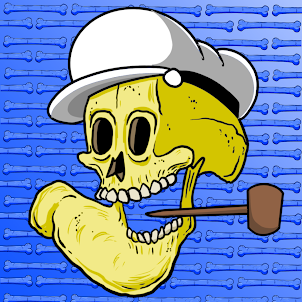

项目网站、社交联系方式、项目介绍内容详见：https://opensea.io/collection/cartoon-skulls-v2

您有机会拥有一个对您的头骨 NFT 拥有完全商业权利的头骨。这些经典和传奇的主要漫画中的许多可能已经成名，但他们的骷髅遗骸将永远存在于区块链中

.png)

##### ▶ 什么是骷髅卡通？

Skull Cartoon 是一个 NFT（非同质代币）系列。存储在区块链上的数字艺术品集合。

##### ▶ 有多少骷髅卡通代币？

总共有 7,790 个骷髅卡通NFT。目前 87位所有者的钱包中至少有一个 Skull Cartoon Club NTF。

##### ▶ 最近卖了多少骷髅卡通俱乐部？

过去 30 天内共售出 0 个 Skull Cartoon Club NFT。

**截止至8月30日**

782**项目**

87**拥有者**

0.01**总容积**

<0.01**底价**