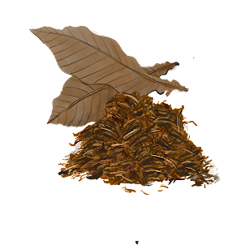

项目网站、社交联系方式、项目介绍内容详见：https://opensea.io/collection/cases-by-kate-imagine

.png)

文本推理 NFT，逐个凯特
Case by Kate 是一个由项目经理、开发人员和作家组成的 Klaytn 文本生成项目。于2021年9月开工，取得了韩国首个以故事为基础的文本格式项目的启动成果。

V1处理“警方追捕的凶手和凶手熟人的陈述”，而在V2中，持有者直接成为“菜鸟侦探”，在资深侦探沃森的帮助下调查罪犯，并获得一张插图卡，里面有犯罪。它处理过量用药。

文本项目，侦探/悬疑类型，所有这些似乎都很难获得。由于项目启动以来，有很多人要求使用或指南，团队意识到需要指南，并根据目前的数据完成了指南制作。