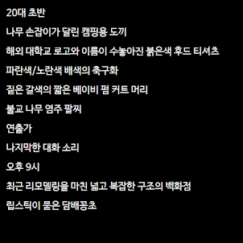

项目网站、社交联系方式、项目介绍内容详见：https://opensea.io/collection/cases-by-kate

Cases by Kate 是世界上第一个韩国生成文本 NFT。以讲故事的形式创作。这 10,000 个 NFT 是关于一起谋杀案，以及凶手熟人的陈述。案件的关键在于你自己的陈述。随意成为一名侦探，用你的创造力追踪线索。

**需要敏锐的推理能力･･･只有嫌疑人的熟人陈述才是“有力证据”** 

 <Cases By Kate> 是讲述谋杀案头号嫌疑人    莫的熟人之一的证词的故事性 NFT，共发布了 10,000 个案例。一共结合了400个特征，生动再现了10000个不同的有趣事件，随机生成的事件的每个属性都有不同的稀有度。 

.png)

**一个事件，多种可能**

  使用 10,000 个案例中属于您的特殊案例，您可以做出不同的猜测。您还可以创建所描绘罪犯外观的蒙太奇，或通过详细查看情况来回顾事件的情况。使用<Cases By Kate>自由解开和解读案件的谜题。案件的所有关键都在您拥有的陈述中。 

信息记录在 Klaytn 区块链上，一旦记录，任何人都无法修改。这 10,000 个事件都是独立的、不重叠的事件，因此都具有特殊的属性。此外，公众号独家购买的《Cases By Kate》具有原版NFT的价值。买家应特别注意冒充项目官员的账户，或冒充项目本身的账户。 

