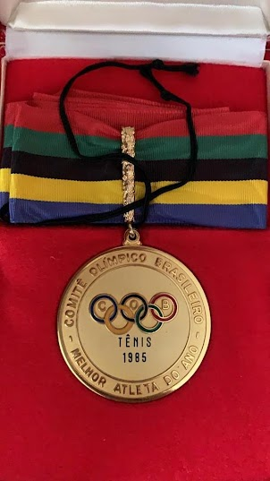

项目网站、社交联系方式、项目介绍内容详见：https://opensea.io/collection/cassio-motta-club-polygon

##### ▶ 什么是 Cassio Motta Club Polygon？

Cassio Motta Club Polygon 是一个 NFT（非同质代币）集合。存储在区块链上的数字艺术品集合。

##### ▶ 有多少 Cassio Motta Club Polygon 代币？

总共有 537 个 Cassio Motta Club Polygon NFT。目前，14 位车主的钱包中至少有一个 Cassio Motta Club Polygon NTF。

##### ▶ 最近售出了多少 Cassio Motta Club Polygon？

过去 30 天内售出了 0 个 Cassio Motta Club Polygon NFT。

**截止至8月30日**

537**项目**

14**拥有者**

0.01**总容积**

<0.01**底价**