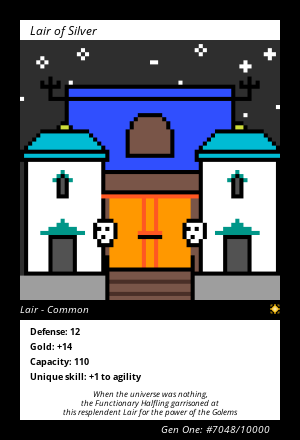

项目网站、社交联系方式、项目介绍内容详见：https://opensea.io/collection/castleslootgenone

骑士，请注意

曾经梦想拥有自己的城堡吗？孤独和绝望的私人堡垒？

CastleDAO 在这里为骑士提供独特的城堡。每座城堡都有独特的特征，例如防御、金币生成、容量、独特技能、故事和设计。

.png)

## 关于城堡

Castles 是部署在 Arbitrum 和以太坊主网中的 NFT 集合。每座城堡都是独一无二的，并且具有独特的连锁特征生成，例如防御、黄金生成、战士……每座城堡都带有独特的随机生成的艺术品

## 如何铸币

您可以从我们的薄荷页面获得随机薄荷

替代方法：转到 Etherscan 中的铸币合约。连接你的钱包。在**写入合约**部分输入可用的 TOKEN id（0-9900 之间的数字）和 0.075 ETH 的 ETH 数量。然后完成交易。

