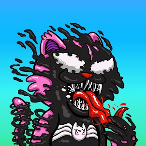
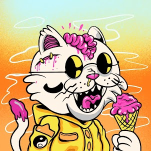

项目网站、社交联系方式、项目介绍内容详见：https://opensea.io/collection/catastrophic-v1

Felinipolis 似乎是爱猫人士的梦想世界。无论你在哪里看，你都可以在每个角落找到一只猫。这些猫是邪恶科学家的灾难性实验的一部分，现在已经变成了爱大脑的僵尸、身体有毒废物的怪物，以及其他对人类及其社会构成威胁的病态生物。我们的特许权使用费将在前两个月从 5% 开始，以维持我们的路线图和长期计划，这 5% 将在两个月后减半，降至 2.5%。我们不想每次你卖出 NFT 时都分到一大块蛋糕，分到一大块蛋糕的时代现在应该结束了。Catastrophic 团队将举办每日和每周的 Loot-box 抽奖活动，其中包含 SOL、ETH、NFT、Merch、以及其他仅供持有人使用的独家物品。街头服饰是我们的长期愿景，我们将与令人兴奋和成功的品牌合作，整合

**截止至8月30日**

18**项目**

1**拥有者**

0.00**总容积**

0.04**底价**