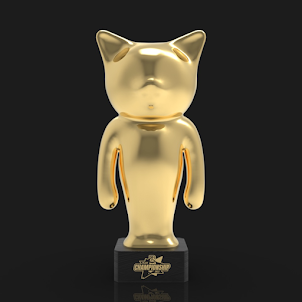

项目网站、社交联系方式、项目介绍内容详见：https://opensea.io/collection/catbloxtbt

## 创世纪会员

您的 Genesis Collection 猫解锁无数福利，包括但不限于：

无限季票
免费
领取 每日 CATNIP 收藏
访问 THE VAULT
品牌合作访问
国库投票
IRL 和虚拟活动访问
Metaverse HQ 访问

.png)

## 四季

季节是 CatBlox 社区和品牌的三个月（大约）主题活动。就像视频游戏或电视节目一样，它们推进了 CatBlox 的核心故事情节。每个赛季都有针对 Genesis Collection 会员的多个激活、事件、掉落、声明和福利。季节也有一个或多个合作伙伴。

每一季都会有现实世界和虚拟活动、Genesis Collection 会员礼物、竞赛、游戏、奖品和 WL 赠品、新的 NFT 收藏和更多惊喜。

