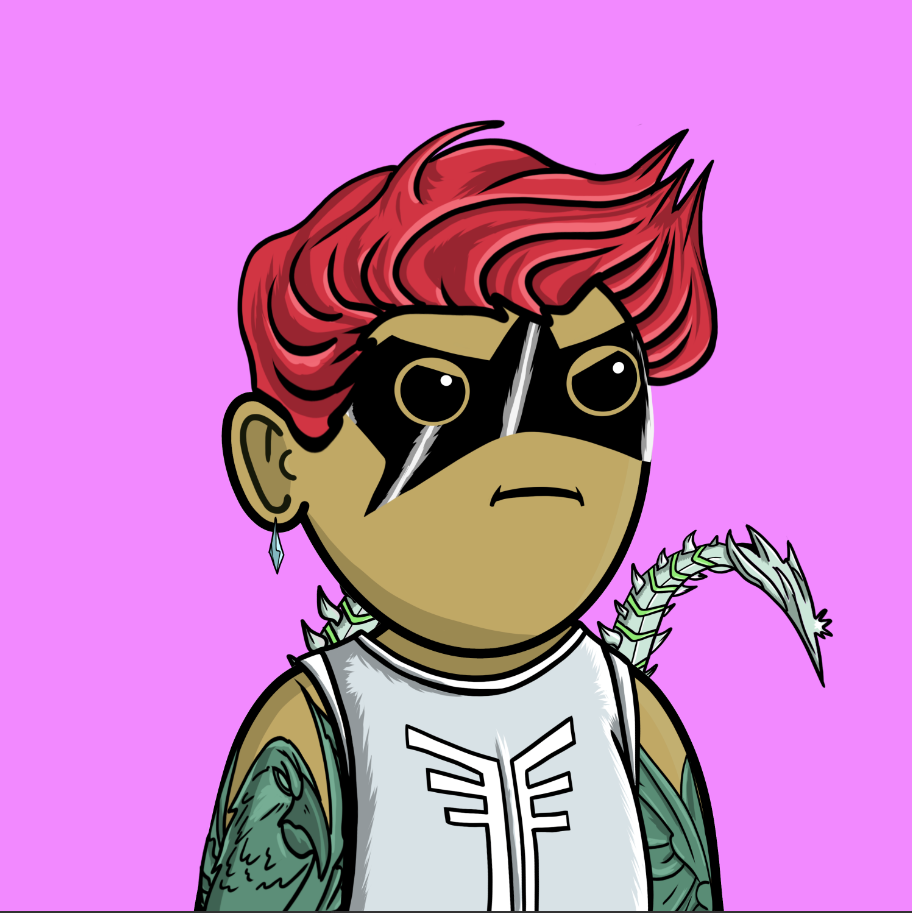

从 Pixel Vault Founder's DAO 诞生的社区主导项目开始，现在已经发展到更多。Moonlings 由艺术家 JuicyJama 和充满激情的团队赋予生命，灵感来自我们最喜欢的一些英雄和恶棍

**初始销售额**

售罄后，初始铸币厂将产生大约 600 ETH 。

资金将用于收购**MetaHeroes**以获取 $POW、通过代币购买和流动性提供来实现**$POW 增长**、用于项目增长的 Community **MoonBank**以及继续建设的**运营成本。**

**截止至9月8日**

10.0K项目

2.9K拥有者

475总容积

<0.01底价

<0.01最好的报价

