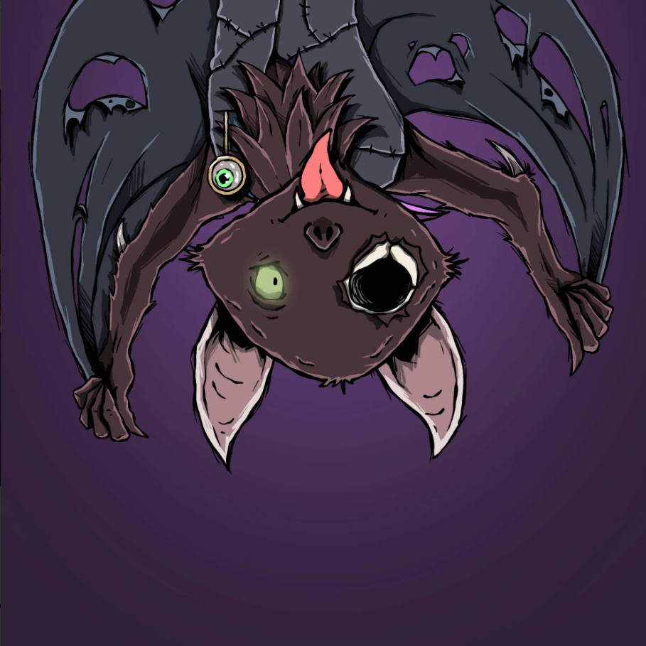
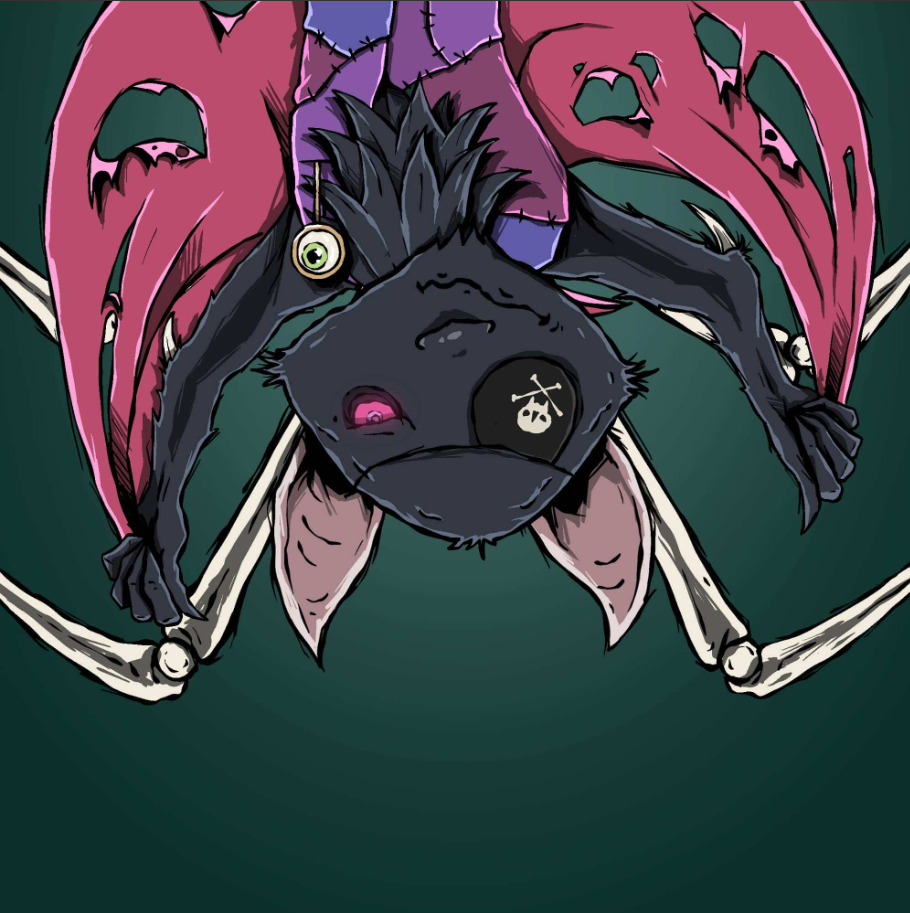

**欢迎来到一个 天翻地覆的世界！**

**月亮蝙蝠**

5555 Genesis Moon Bats的到来颠覆了我们的世界。一个免费的薄荷艺术项目，旨在向 NFT 空间展示这个世界已经变得多么颠倒。

原本10,000烧毁到5555。Open Sea数并没有反映这一点。

**月亮鞋面**

1750 Moon Vamps* 是第二个只能通过我们的 $BLOOD 代币为 Moon Bat 持有者铸造的系列。

原本 2500 烧毁到 1750。Open Sea 的数字并没有反映这一点。

