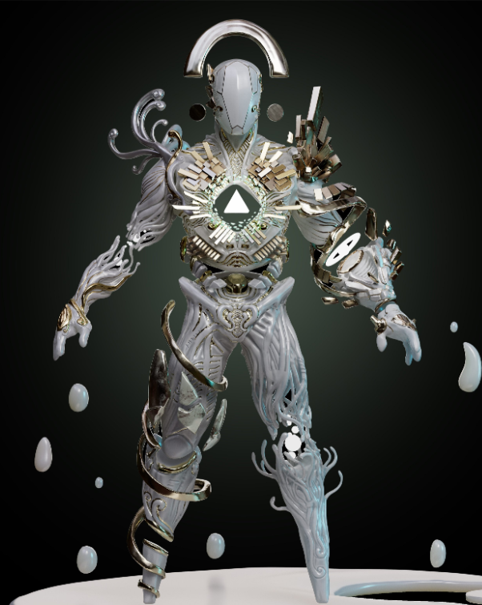
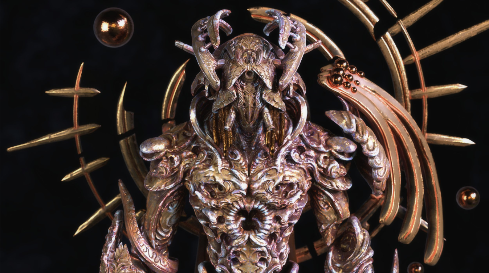

**一般的问题**

**路线图**

游戏启动（不同的游戏循环）

- 我们希望在 6 月推出封闭 Alpha 版，我们的目标是在早秋之前进入开放 Beta 版。我们将定期发布内容和游戏模式（主要是新的竞技场、PVP 模式和招式）。
- Alpha 和 Beta 游戏模式将专注于 PVP，并将发展到包括 1v1、2v2、4v4 和大逃杀
- Play-to-earn 功能只有在 Beta 测试后才能确保战斗玩法平衡，我们目前预计 P2E 将在今年 Q3/Q4 的某个时候工作
- 我们当前的重点是 100% 正确地完成 PVP 和 P2E。一旦 PVP 和 P2E 稳定，我们将寻求开发 PVE 游戏模式。

**NTF**

- 我们的经济将包含各种 NFT，例如头像、武器、魔法和其他物品，可以升级和交易。
- 我们的下一个 NFT 铸币厂将是 Genesis Drop，它将与 Beta 版大约在同一时间进行——我们不想在 NFT 可以在游戏中玩之前出售它们，所以我们等到接近 Beta 版再做另一个薄荷

**土地**

- 我们计划在今年晚些时候对我们的大型开放世界环境进行技术演示。一旦我们证明了我们的技术基础设施，我们将公布如何使用土地的详细信息。
- 土地销售将在之后进行——最早在年底前

**代币经济学**

**月光有代币吗？**

- Moonray Game 由 Moonray PBC（一家位于美国的游戏发行公司）开发。Moonray 游戏将具有处理多种代币的功能，包括 ILTAR Corp 发行的 MNRY 代币。此外，Moonray 游戏旨在为 MNRY 提供游戏内功能和实用程序。

