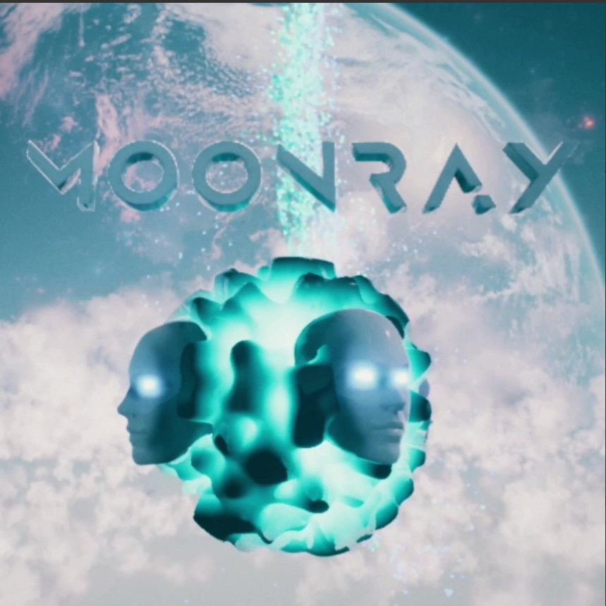
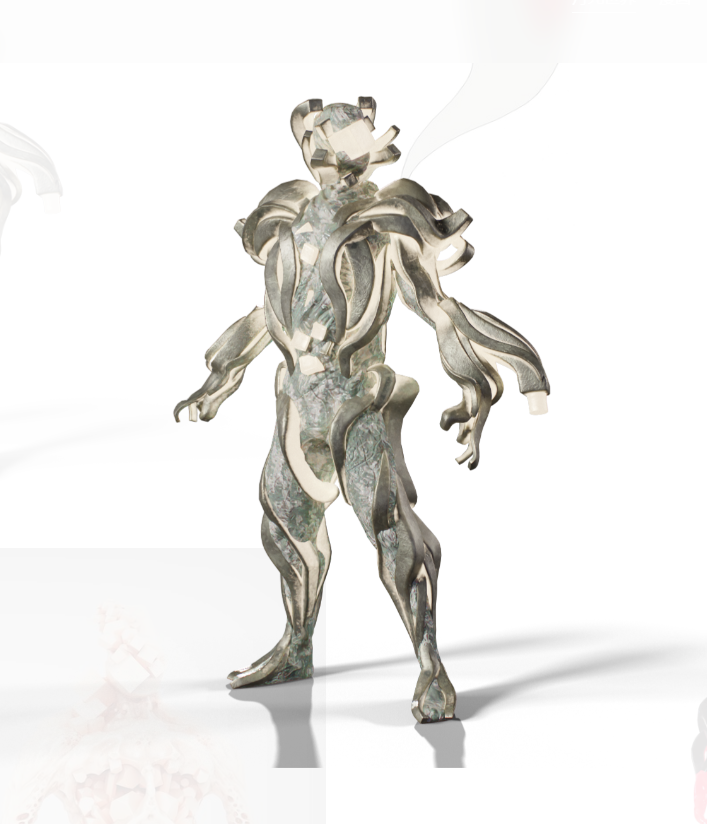

官方预售通行证持有者将获得独家抢先体验 Moonray 的 Genesis NFT Drop 和接下来的两个 NFT Drop。

此外，每张通行证在参与掉落时将能够（免费）领取一份 Moonray 的限量版、创世角色皮肤 NFT。

**你需要NTF才能玩吗？**

- Play-to-earn 游戏模式和抢先体验将由 NFT 控制，并且需要头像 NFT 才能访问。免费模式已计划好，最早将在公测结束时实施
- 例如，有奖 PVP 锦标赛将要求玩家拥有头像 NFT 才能进入 - 并且可能还有其他要求；但是，对于不想参加 P2E 的玩家，将会有免费的 PVP 竞技场。
- 随着我们进入公开测试版，Avatar NFT 将以不同的价格点和数量提供。

**Moonray 是否与任何公会合作？**

- 是的，我们很快就会宣布与公会建立合作伙伴关系。

**你在构建什么区块链？**

- 以太坊主网。它最符合我们的开发需求，使我们能够最大程度地交付游戏的 Alpha 和 Beta 版本，以及在未来必要时转向另一个 L1 或 L2 的灵活性。我们正在分析 L2 和其他 L1，那里有许多有趣且快速发展的技术，时机成熟时，我们将更仔细地研究哪些其他区块链可能对我们有意义。

