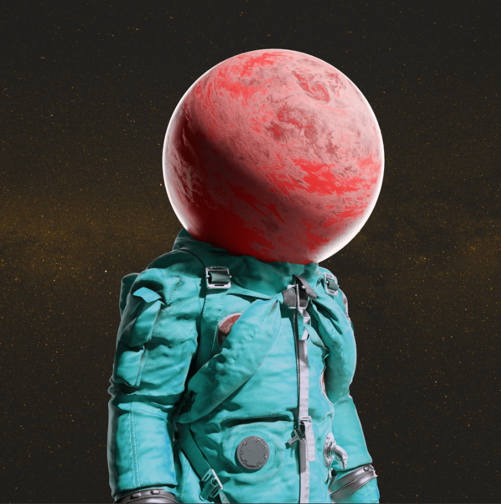
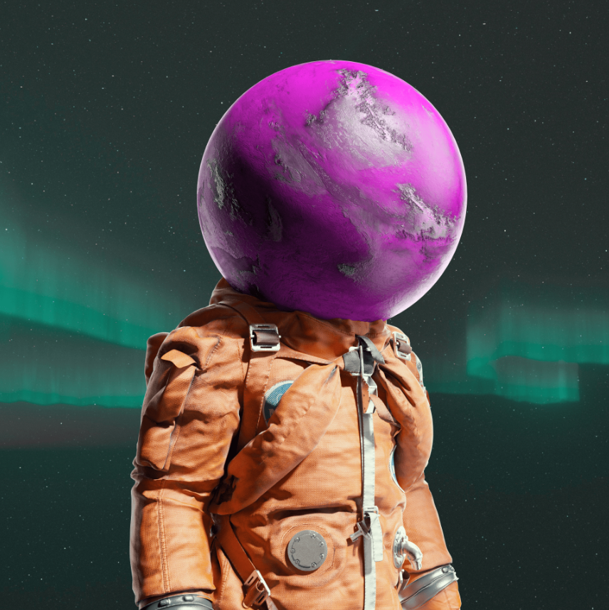

**不同层次的艺术**

**关于艺术家**

世界著名的 3D 艺术家，在主要平台上拥有超过 10 万粉丝，Liam Pannier 被广泛认为是其艺术形式的领先专家。他专注于杰出的太空艺术品，每件在世界各地的售价都高达数千美元。

曾为华纳兄弟、Def Jams 和派拉蒙唱片等公司工作过的 Liam 对企业合作伙伴关系以及如何驾驭它们并不陌生。

为了完成这个项目，他花了几个月的时间来研究每种颜色、纹理和元素，以确保艺术作品的细节和令人惊叹。他创造了一个关于角色的完整故事，并真正投入了艺术作品，希望你会和我们一样喜欢它！

**空间艺术中的第一个元空间画廊**

在我们的Metaverse Moonwalkers艺术画廊中几乎漫步于著名艺术家的艺术作品中。该展览将是我们社区独有的，艺术品将由一些最伟大的太空艺术家设计。您将有机会与知名艺术家讨论并购买展示的艺术品作为独特的NFT作品。

