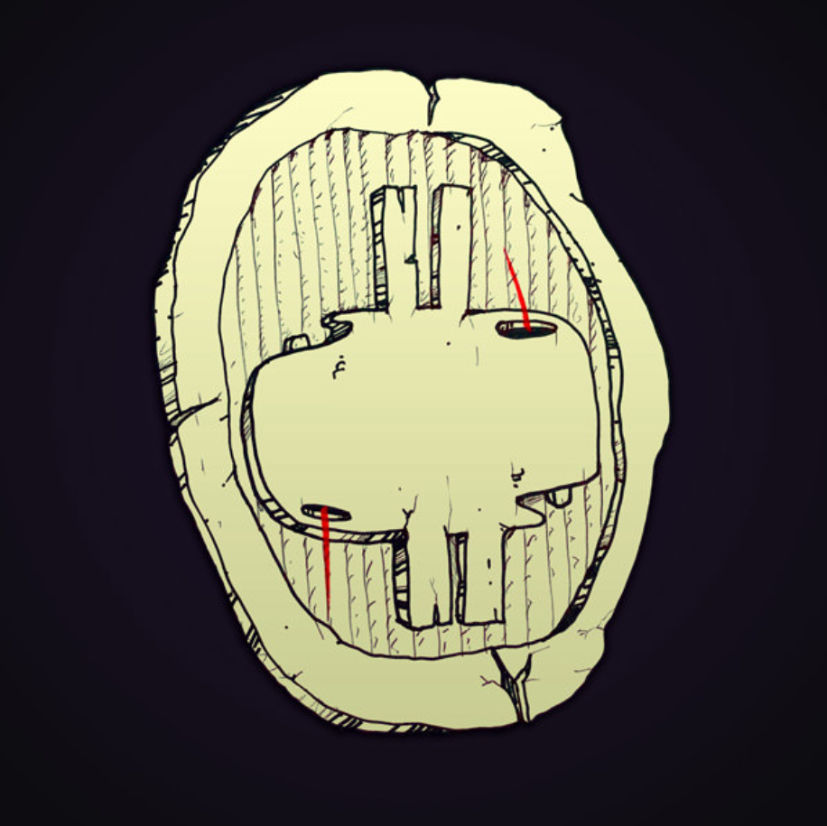

**所有 Munkos 都是独一无二的；所有芒科人都是独一无二的。**

Munkos 存在于数字和物理领域。

作为 Munko，您将可以访问 Phase VI，这是一个分布式的、协作的、体验式的艺术作品，它在其他 Munkos 的社区中展开。

铸币后，代币持有者可以使用 QUESTionnaire 生成他们的个人 Munko。

**有多少个 MUNKO NFT？**

有 7,563 个。

**如何购买 MUNKO NFT？**

Munko 铸币厂窗口已永远关闭。Munkos 可通过 OpenSea 上的 3rd 方销售获得。

**如何查看我的 MUNKO NFT？**

交易完成后，您可以通过几种不同的方式查看您的 Munko NFT：

- **Munko.io：**通过网站顶部的“连接钱包”功能连接您的钱包。Munko 目录将在 QUESTionairre 之后不久打开。
- **MetaMask：**在移动应用程序中选择 NFT 选项卡以查看钱包中的所有 NFT。
- **台式机/笔记本电脑：**访问Opensea.io并单击右上角的用户图标。连接您的钱包，然后从下拉列表中单击“个人资料”以查看您收藏中的所有 NFT。

您可能需要点击 Opensea 上的“刷新元数据”图标才能查看更新后的 Munko NFT。