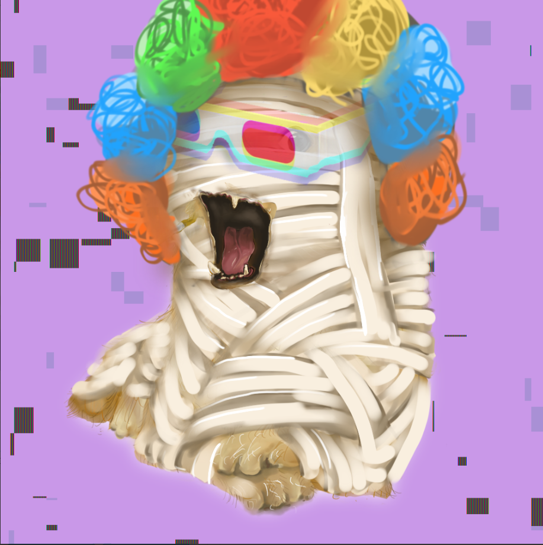

##### ▶ 什么是总督博物馆？

总督博物馆是一个 NFT（不可替代代币）收藏。存储在区块链上的数字艺术品集合。

##### ▶ 总督博物馆有多少代币？

总共有 9,998 个 Doge NFT 博物馆。目前，1,123 名业主的钱包中至少有一个总督博物馆 NTF。

##### ▶ 总督博物馆最近卖出了多少？

过去 30 天内共售出 0 个 Doge NFT 博物馆。

**截止至9月8日**

10.0K项目

1.1K拥有者

10.7总容积

<0.01底价