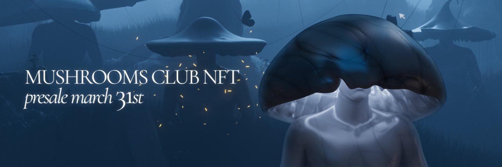
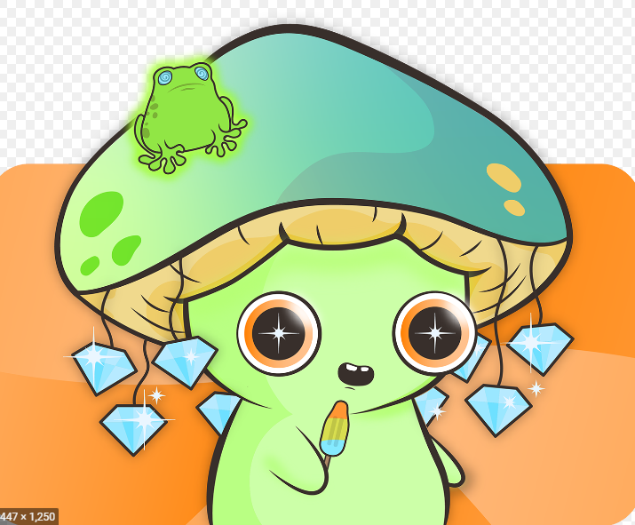

**Mushrooms Club 是一个以社区为重点的衍生 NFT 集合，包含 9,999 个稀有 Nft。** **每个 NFT 都是使用 140 多种属性（如帽子、眼睛、皮肤等等）的组合通过算法生成的！** **Mushrooms Club 在以太坊 (ETH) 区块链上推出，以实惠的价格提供高质量的艺术品，同时执行广泛的路线图。**

##### ▶ 什么是蘑菇俱乐部？

Mushrooms Clube 是一个 NFT（非同质代币）集合。存储在区块链上的数字艺术品集合。

##### ▶ 有多少 Mushrooms Clube 代币？

总共有 100 个 Mushrooms Clube NFT。目前 3 位所有者的钱包中至少有一个 Mushrooms Clube NTF。

##### ▶ 最近卖出了多少蘑菇俱乐部？

过去 30 天内共售出 0 个 Mushrooms Clube NFT

**截止至9月8日**

100项目

3拥有者

0.01总容积

<0.01底价