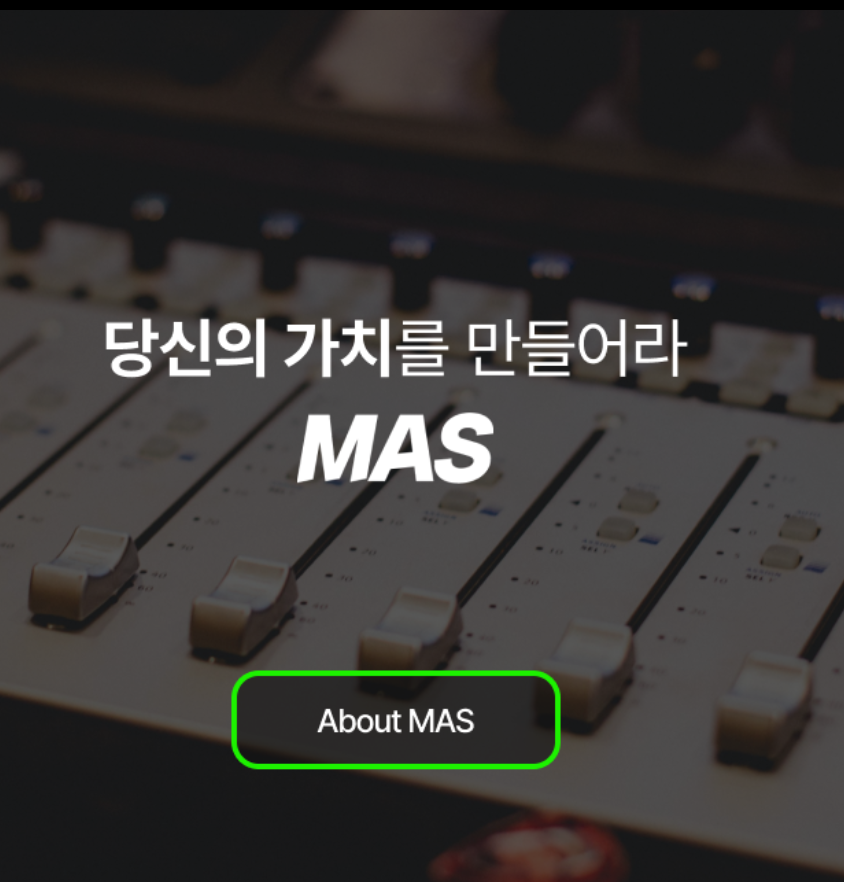
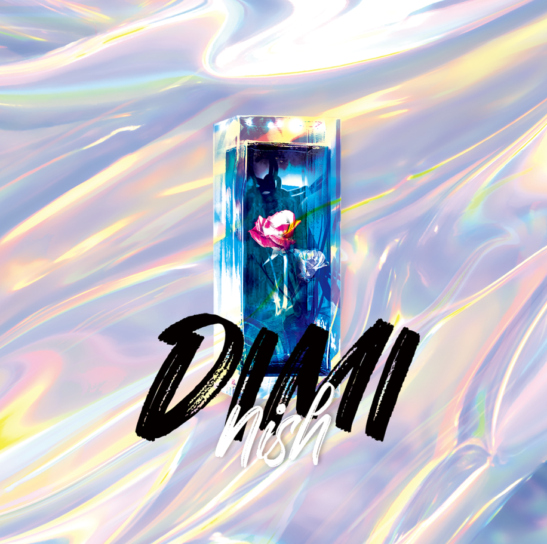

**区块链**不是传统的中心服务器存储方式，
区块数据是相互存储的，所以
**1.去中心化和2.伪造是不可能的**。

**Non-Fungible Token NFT**是一种结合区块链技术的
**数字作品原创证明**技术。

**过去，数字音源在没有原创概念的情况下被非法复制和使用。**

没有“市场认可的价值”，

通过**NFT 技术**创建**清晰的来源和所有权证明。**

您可以**通过赋予**您的创作稀有性来创造**“市场认可的价值” 。**

**MAS 的好处**

在 MAS，您的作品被**交易给追随者、收藏家和音乐家**，

NFT根据授予的权利**产生销售收入、版权费和再交易费（版税）**。