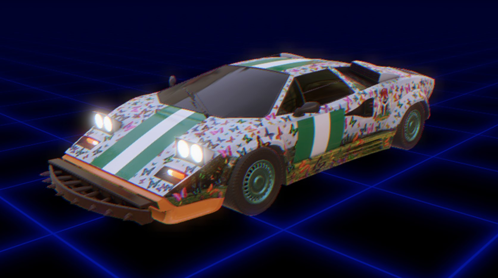

MusicRacerNFT可在即将发布的 Music Racer 2000 中播放——这是一款基于以太坊区块链的 Play2Earn 赛车游戏。每辆汽车都是完全独一无二的，具有定制的设计，配备了特定的属性和可识别的美学

##### ▶ 什么是 MusicRacerNFT？

MusicRacerNFT 是一个 NFT（不可替代令牌）集合。存储在区块链上的数字艺术品集合。

##### ▶ 存在多少 MusicRacerNFT 代币？

总共有 313 个 MusicRacerNFT NFT。目前，198 位所有者的钱包中至少有一个 MusicRacerNFT NTF。

##### ▶ 最近卖出了多少 MusicRacerNFT？

过去 30 天内售出了 0 个 MusicRacerNFT NFT。

