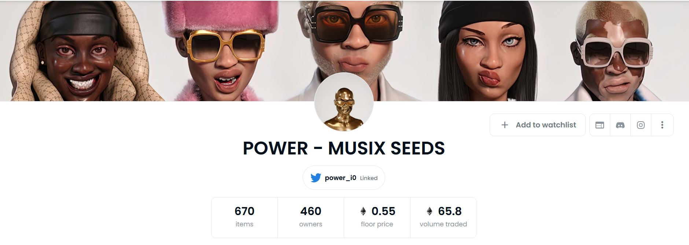
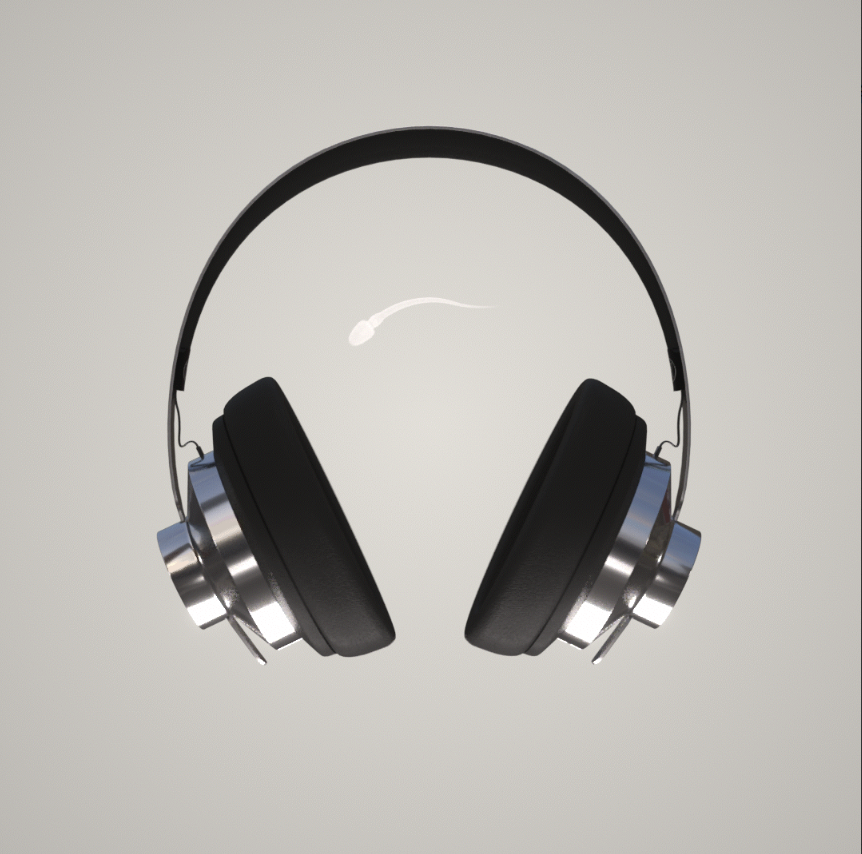

##### ▶ 什么是 Power Musix Seeds？

Power Musix Seeds 是一个 NFT（不可替代令牌）集合。存储在区块链上的数字艺术品集合。

##### ▶ 有多少 Power Musix Seeds 代币？

总共有 538 个 Power Musix Seeds NFT。目前，310 位所有者的钱包中至少有一个 Power Musix Seeds NTF。

##### ▶ 最近卖出了多少 Power Musix Seeds？

过去 30 天内售出了 1 个 Power Musix Seeds NFT。

**截止至9月8日**

538项目

310拥有者

264总容积

0.1底价

<0.01最好的报价